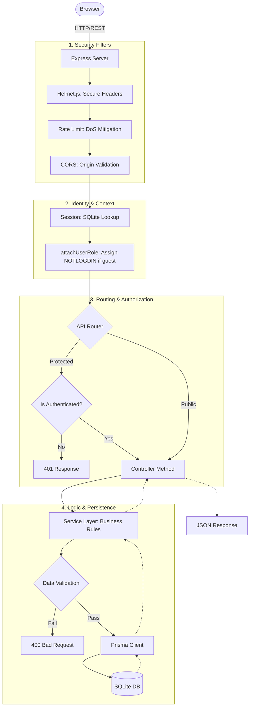
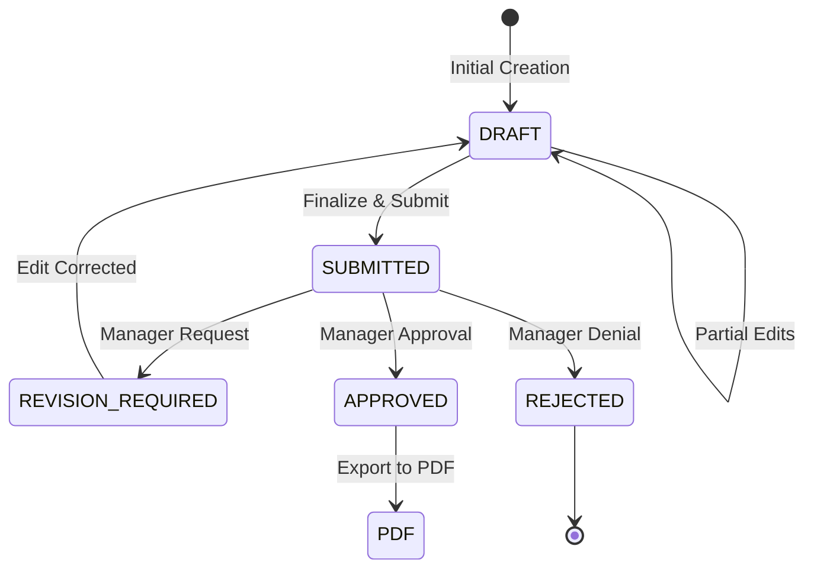
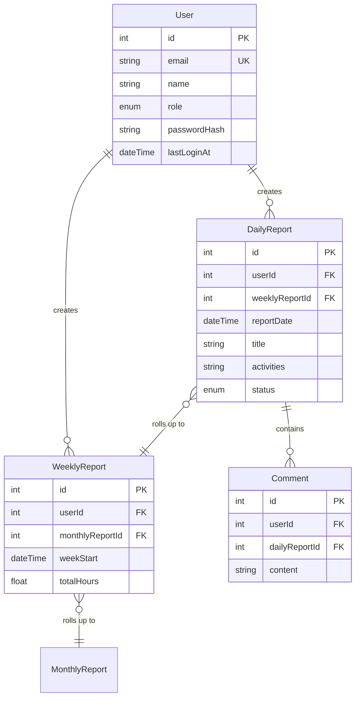

# Berichts-Heft: System Architecture & Technical Deep-Dive

This document provides a comprehensive overview of the technical architecture, data flows, and design patterns used in the Berichts-Heft application.

---

## 1. High-Level Technology Stack

| Layer | Technology | Role |
| :--- | :--- | :--- |
| **Frontend** | React v19 + Vite | SPA Framework, Hooks-based state, client-side routing. |
| **Backend** | Node.js + Express.js | API server, middleware pipeline, business logic. |
| **Database** | SQLite + Prisma | Relational storage, type-safe migrations and queries. |
| **Security** | bcrypt + Session | Password hashing, stateful session management. |
| **Testing** | Vitest | Fast unit and integration tests. |

---

## 2. Detailed Request Lifecycle

Every request follows a multi-stage pipeline designed for security and scalability.

---

## 3. Core Mechanics

### A. Authentication & "NOTLOGDIN" Role
The system ensures that `req.user.role` is **always** defined. If a user is not logged in, they are assigned the `NOTLOGDIN` role. This allows frontend and backend logic to perform role-based checks without worrying about `undefined` errors.

**Login Sequence:**
1. Client sends email/password.
2. `authService` performs a lookup by `email` or `name` (optimized via DB indexes).
3. `bcrypt.compare` verifies the hash.
4. User object is injected into the session.

### B. Report State Machine
Reports follow a strict lifecycle to ensure quality and accountability.

### C. Error Handling Strategy
The system uses a centralized error-handling pattern. Services throw specific errors (e.g., `NotFoundError`), and a global middleware catches them to return a standardized format: `{ "error": "Message" }`.

**Key Error Classes:**
- `BadRequestError` (400)
- `UnauthorizedError` (401)
- `ForbiddenError` (403)
- `NotFoundError` (404)
- `ConflictError` (409)

---

## 4. Entity Relationship Diagram (ERD)

The database structure focuses on hierarchical report relationships (Daily -> Weekly -> Monthly -> Yearly).

---

## 5. Development & Verification
To maintain this architecture:
1. **Schema Changes**: Update `prisma/schema.prisma` and run `npm run prisma:generate`.
2. **Linting**: All code must pass `npm run lint` (ESLint v9 Flat Config).
3. **Tests**: Verify logic with `npm test` (Vitest).

---
*Created by Antigravity AI Coding Assistant.*
