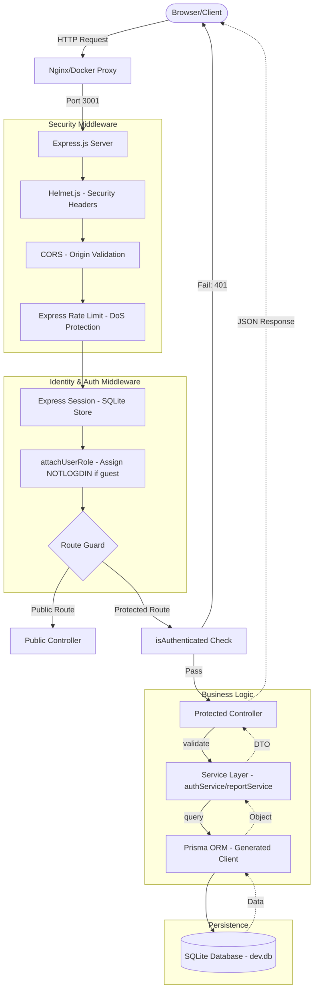
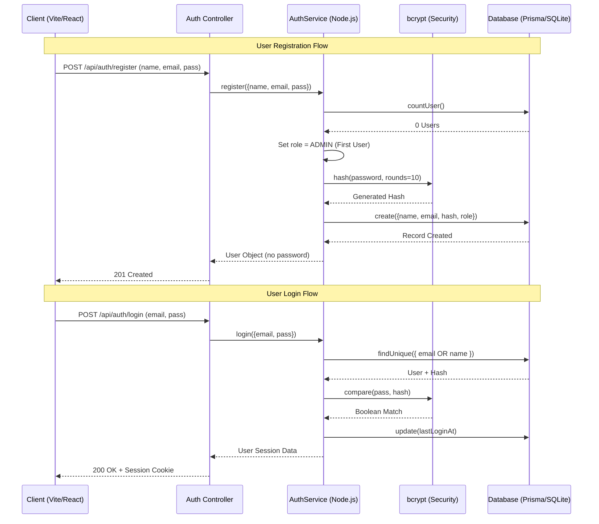
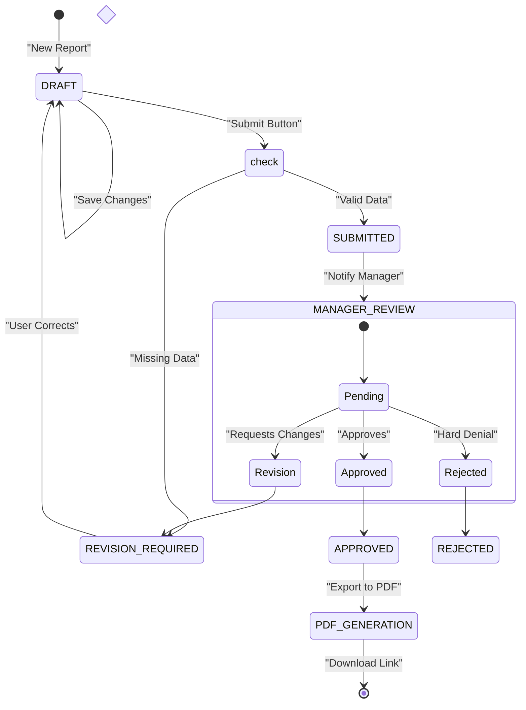

# system flow
---

## 1. Request Processing Pipeline (Deep Dive)
This flow shows every security and logic layer a request passes through before reaching the database.



---

## 2. Authentication Detailed Sequence
The precise logic used during the login and registration process.



---

## 3. Report Management Workflow (Comprehensive)
The business rules governing how reports move through states.



---

## 4. Entity Relationship Diagram (Detailed)
The actual structure of the database tables and their foreign key constraints.

```dbml
// Full schema DBML for https://dbdiagram.io


Table User {
  id            integer     [pk, increment]
  email         varchar     [unique, not null]
  name          varchar     [not null]
  role          varchar     [not null, default: 'USER', note: 'ADMIN | MANAGER | USER | TEST']
  jobTitle      varchar     [null]
  workplaceType varchar     [null, note: 'HOME | OFFICE | BAUSTELLE']
  passwordHash  varchar     [not null]
  lastLoginAt   datetime    [null]
  lastLoginIp   varchar     [null]
  createdAt     datetime    [not null, default: `now()`]
  updatedAt     datetime    [not null]

  indexes {
    email [name: 'idx_user_email']
  }
}

Table DailyReport {
  id             integer      [pk, increment]
  userId         integer      [not null, ref: > User.id]
  weeklyReportId integer      [null, ref: > WeeklyReport.id]
  reportDate     datetime     [not null]
  title          varchar      [not null]
  activities     text         [null]
  learnings      text         [null]
  challenges     text         [null]
  hoursWorked    float        [not null]
  weather        varchar      [null, note: 'Sonne | Wind | Regen | Schnee | Frost']
  weatherTemp    float        [null]
  status         varchar      [not null, default: 'DRAFT', note: 'DRAFT | SUBMITTED | APPROVED | REJECTED | REVISION_REQUIRED']
  createdAt      datetime     [not null, default: `now()`]
  updatedAt      datetime     [not null]

  indexes {
    userId       [name: 'idx_dailyreport_user']
    weeklyReportId [name: 'idx_dailyreport_weekly']
    reportDate   [name: 'idx_dailyreport_date']
    status       [name: 'idx_dailyreport_status']
  }
}

Table DailyTimeEntry {
  id            integer   [pk, increment]
  dailyReportId integer   [not null, ref: > DailyReport.id]
  userId        integer   [not null, ref: > User.id]

  // What was done ( Deren Job Name)
  jobTitle        varchar  [null]
  workDescription text     [not null]

  // Travel to site (Anfahrt von-bis)
  travelArrivalStart  datetime [null]
  travelArrivalEnd    datetime [null]

  // Work time (Arbeitszeit von-bis)
  workStart  datetime [not null]
  workEnd    datetime [not null]

  // Travel from site (Abfahrt von-bis)
  travelDepartureStart  datetime [null]
  travelDepartureEnd    datetime [null]

  // Break (abzgl. Pause)
  pauseMinutes  integer [null]
  hoursTotal    float   [not null]

  // Location & driving
  location      varchar [null]
  driveRequired boolean [not null, default: false]
  distanceKm    float   [null]

  // Preparation
  preparationRequired boolean [not null, default: false]
  preparationNotes    text    [null]

  // Site specifics (Bautagebericht)
  liftingAids   varchar [null, note: 'JSON array: AUTOKRAN | SCHRAEGAUFZUG | TELESKOPSTAPLER | ARBEITSBUEHNE | GERUEST']
  equipment     text    [null, note: 'Maschinen- und Geräteeinsatz']
  obstacles     text    [null, note: 'Behinderungen / Erschwernisse']
  materialUsed  text    [null, note: 'Materialverbrauch']

  status    varchar  [not null, default: 'DRAFT', note: 'DRAFT | SUBMITTED | APPROVED | REJECTED | REVISION_REQUIRED']
  createdAt datetime [not null, default: `now()`]
  updatedAt datetime [not null]

  indexes {
    dailyReportId [name: 'idx_timeentry_report']
    userId        [name: 'idx_timeentry_user']
    workStart     [name: 'idx_timeentry_workstart']
    status        [name: 'idx_timeentry_status']
  }
}

Table WeeklyReport {
  id              integer  [pk, increment]
  userId          integer  [not null, ref: > User.id]
  monthlyReportId integer  [null, ref: > MonthlyReport.id]
  name            varchar  [null]
  weekStart       datetime [null]
  weekEnd         datetime [null]
  weekNumber      integer  [null]
  department      varchar  [null]
  yearOfTraining  integer  [null]
  summary         text     [null]
  activities      text     [null]
  school          varchar  [null]
  totalHours      float    [null]
  remarks         text     [null]
  status          varchar  [not null, default: 'DRAFT', note: 'DRAFT | SUBMITTED | APPROVED | REJECTED | REVISION_REQUIRED']
  createdAt       datetime [not null, default: `now()`]
  updatedAt       datetime [not null]

  indexes {
    userId          [name: 'idx_weeklyreport_user']
    monthlyReportId [name: 'idx_weeklyreport_monthly']
    (weekStart, weekEnd) [name: 'idx_weeklyreport_range']
    status          [name: 'idx_weeklyreport_status']
  }
}

Table MonthlyReport {
  id              integer  [pk, increment]
  userId          integer  [not null, ref: > User.id]
  yearlyReportId  integer  [null, ref: > YearlyReport.id]
  month           integer  [not null]
  year            integer  [not null]
  monthStart      datetime [not null]
  monthEnd        datetime [not null]
  summary         text     [ null]
  keyAchievements text     [ null]
  goals           text     [ null]
  totalHours      float    [ null]
  yearOfTraining  integer  [null]
  name            varchar  [not null]
  instructions    text     [not null]
  remarks         text     [not null]
  status          varchar  [not null, default: 'DRAFT', note: 'DRAFT | SUBMITTED | APPROVED | REJECTED | REVISION_REQUIRED']
  createdAt       datetime [not null, default: `now()`]
  updatedAt       datetime [not null]

  indexes {
    userId         [name: 'idx_monthlyreport_user']
    yearlyReportId [name: 'idx_monthlyreport_yearly']
    (month, year)  [name: 'idx_monthlyreport_period']
    status         [name: 'idx_monthlyreport_status']
  }
}

Table YearlyReport {
  id             integer  [pk, increment]
  userId         integer  [not null, ref: > User.id]
  year           integer  [not null]
  trainingYear   varchar  [not null]
  yearStart      datetime [not null]
  yearEnd        datetime [not null]
  summary        text     [ null]
  achievements   text     [ null]
  skillsImproved text     [ null]
  goals          text     [ null]
  totalHours     float    [ null]
  status         varchar  [ null, default: 'DRAFT', note: 'DRAFT | SUBMITTED | APPROVED | REJECTED | REVISION_REQUIRED']
  createdAt      datetime [ not null, default: `now()`]
  updatedAt      datetime [ not null]

  indexes {
    userId [name: 'idx_yearlyreport_user']
    year   [name: 'idx_yearlyreport_year']
    status [name: 'idx_yearlyreport_status']
  }
}

Table Attachment {
  id               integer  [pk, increment]
  dailyReportId    integer  [null, ref: > DailyReport.id]
  weeklyReportId   integer  [null, ref: > WeeklyReport.id]
  monthlyReportId  integer  [null, ref: > MonthlyReport.id]
  yearlyReportId   integer  [null, ref: > YearlyReport.id]
  dailyTimeEntryId integer  [null, ref: > DailyTimeEntry.id]
  fileName         varchar  [not null]
  filePath         varchar  [not null]
  fileSize         integer  [null]
  mimeType         varchar  [null]
  uploadedAt       datetime [not null, default: `now()`]

  indexes {
    dailyReportId    [name: 'idx_attachment_daily']
    weeklyReportId   [name: 'idx_attachment_weekly']
    monthlyReportId  [name: 'idx_attachment_monthly']
    yearlyReportId   [name: 'idx_attachment_yearly']
    dailyTimeEntryId [name: 'idx_attachment_timeentry']
  }
}

Table Comment {
  id              integer  [pk, increment]
  userId          integer  [not null, ref: > User.id]
  dailyReportId   integer  [null, ref: > DailyReport.id]
  weeklyReportId  integer  [null, ref: > WeeklyReport.id]
  monthlyReportId integer  [null, ref: > MonthlyReport.id]
  yearlyReportId  integer  [null, ref: > YearlyReport.id]
  content         text     [not null]
  createdAt       datetime [not null, default: `now()`]

  indexes {
    userId          [name: 'idx_comment_user']
    dailyReportId   [name: 'idx_comment_daily']
    weeklyReportId  [name: 'idx_comment_weekly']
    monthlyReportId [name: 'idx_comment_monthly']
    yearlyReportId  [name: 'idx_comment_yearly']
  }
}

```

## 5. Technical Stack Overview

| Component | Technology | Detail |
| :--- | :--- | :--- |
| **Runtime** | Node.js | v18+ Recommended |
| **Language** | JavaScript (ESM) | Using Modern Syntax |
| **Web Server** | Express.js v5 | For RESTful API Endpoints |
| **Frontend** | React v19 | With functional components and hooks |
| **Build Tool** | Vite | For fast HMR and optimized builds |
| **Database** | SQLite | Local relational storage (Zero-config) |
| **ORM** | Prisma v7 | Type-safe database management |
| **Styling** | Vanilla CSS | Custom design system |
| **Testing** | Vitest | Fast unit testing |
| **Tooling** | ESLint + Prettier | Code quality and formatting |
