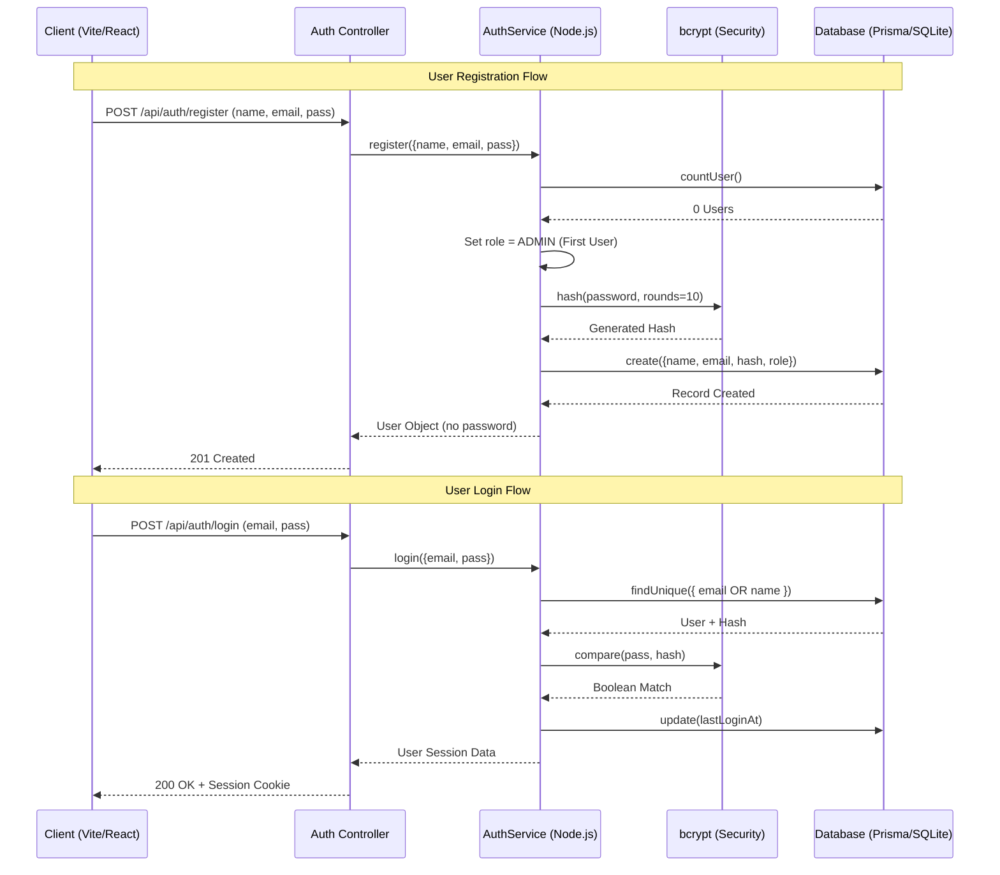
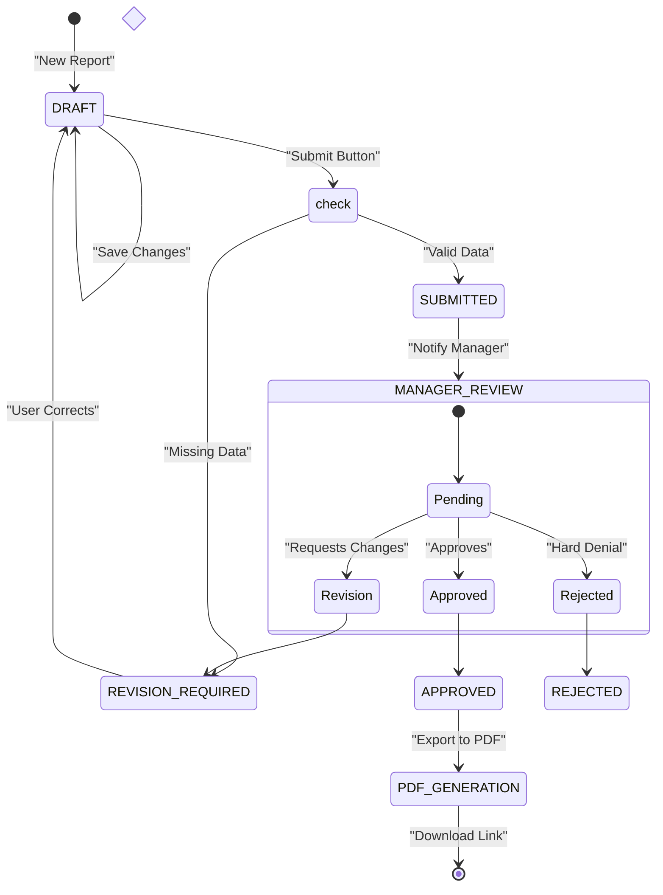
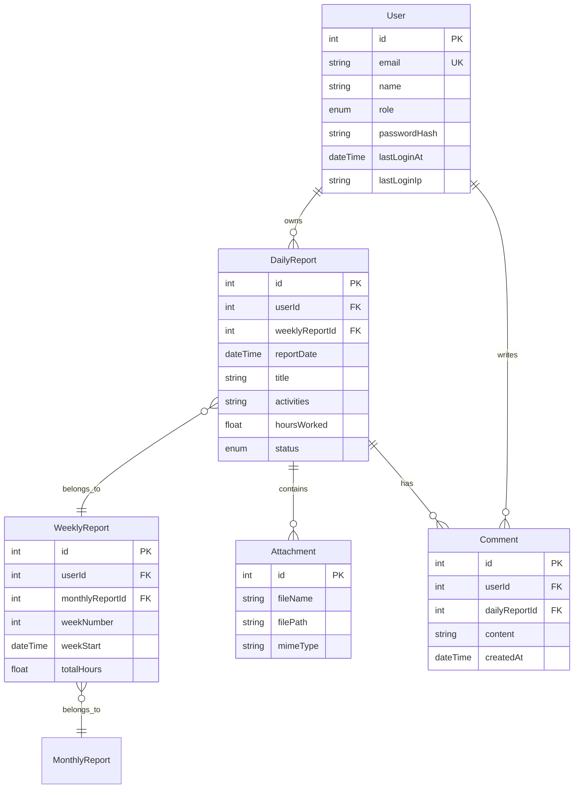

# system flow
---

## 1. Request Processing Pipeline (Deep Dive)
This flow shows every security and logic layer a request passes through before reaching the database.

---

## 2. Authentication Detailed Sequence
The precise logic used during the login and registration process.

---

## 3. Report Management Workflow (Comprehensive)
The business rules governing how reports move through states.

---

## 4. Entity Relationship Diagram (Detailed)
The actual structure of the database tables and their foreign key constraints.

---

## 5. Technical Stack Overview

| Component | Technology | Detail |
| :--- | :--- | :--- |
| **Runtime** | Node.js | v18+ Recommended |
| **Language** | JavaScript (ESM) | Using Modern Syntax |
| **Web Server** | Express.js v5 | For RESTful API Endpoints |
| **Frontend** | React v19 | With functional components and hooks |
| **Build Tool** | Vite | For fast HMR and optimized builds |
| **Database** | SQLite | Local relational storage (Zero-config) |
| **ORM** | Prisma v7 | Type-safe database management |
| **Styling** | Vanilla CSS | Custom design system |
| **Testing** | Vitest | Fast unit testing |
| **Tooling** | ESLint + Prettier | Code quality and formatting |
